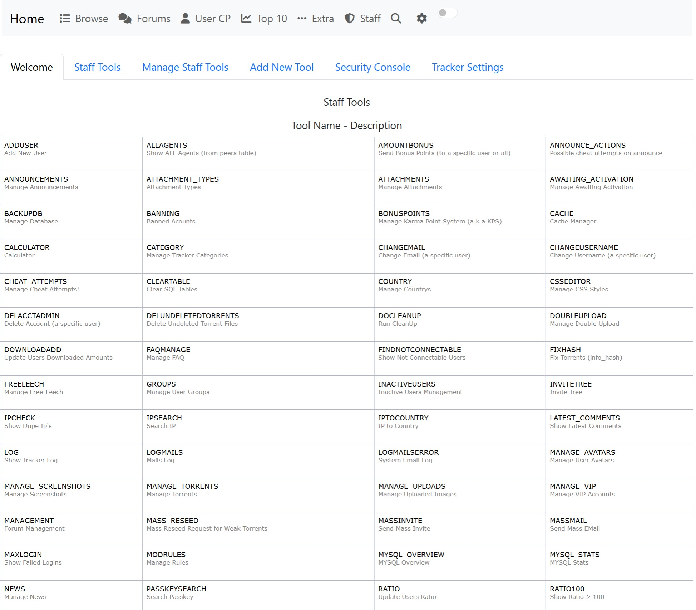

# 🎬 PHP Torrent Tracker

[](https://www.php.net/)
[](https://www.mysql.com/)
[](https://getcomposer.org/)
[](LICENSE)

> ⚡ A lightweight **PHP-based torrent tracker** with announce system,  
> built-in torrent parser, and a simple but functional admin panel.  

Perfect for **private communities**, testing torrent workflows, or learning how trackers work under the hood.  

---

## 📸 Screenshots 

### 🔹 Main Page


### 🔹 Torrent Details


### 🔹 Upload page


### 🔹 Admin Panel


---

## ✨ Features
- 🔗 **Announce system** — fully working announce endpoint for torrents  
- 📂 **Torrent file parsing** via [arokettu/torrent-file](https://github.com/arokettu/torrent-file)  
- 🛠 **Admin panel** for managing users, torrents, and site settings  
- 🍪 **Cookie-based sessions** for authentication  
- 🎨 Simple, clean codebase — easy to customize and extend  

---

## ⚡ Installation

### 1. Import Database
Upload the SQL file from:
admin/backup


and import it into your MySQL/MariaDB database.

### 2. Install Dependencies
composer require arokettu/torrent-file


### 3. Configure Database
Edit `include/config.php`:
```php
$config['database']['database'] = 'dbname';
$config['database']['hostname'] = 'localhost';
$config['database']['username'] = 'user';
$config['database']['password'] = 'password';
4. Configure Announce
Edit include/config_announce.php:


$mysql_host = '';
$mysql_user = '';
$mysql_pass = '';
$mysql_db   = '';

$BASEURL = 'https://localhost';
$SITENAME = 'Tracker Name';
5. Configure Site Settings
Edit include/settings.php:


$SITENAME = "Tracker Name";
$BASEURL = "https://localhost";
$cookiedomain = ".localhost";
$announce_urls[] = "https://localhost/announce.php";
6. Default Admin User

Username: Admin
Password: 123456
✅ Ready to Go
After completing these steps, your tracker should be up and running.
Please don’t kill me hahah 😅

📌 Requirements
PHP 8.4

MySQL 5.7+ / MariaDB

Composer
