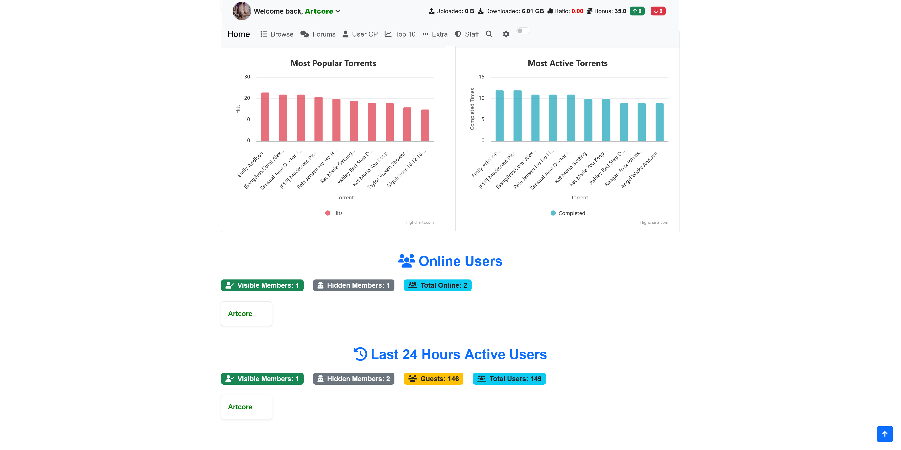
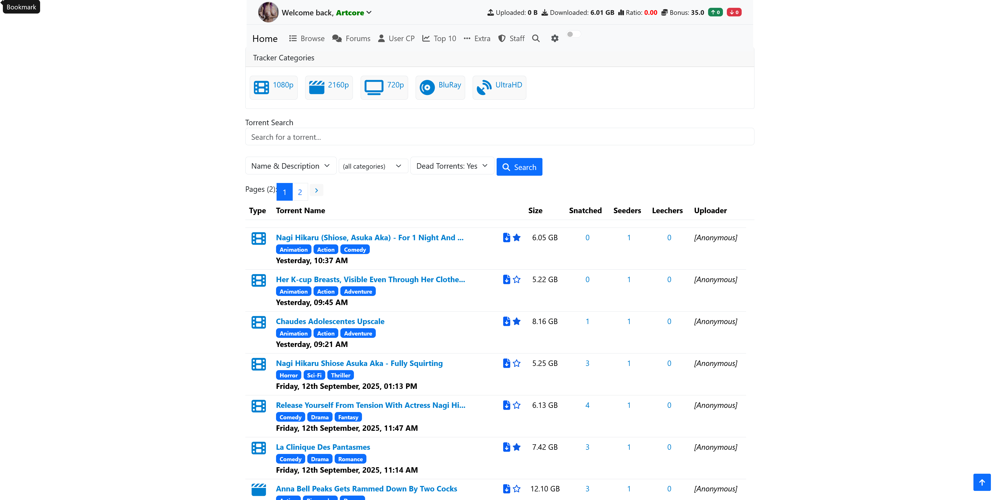
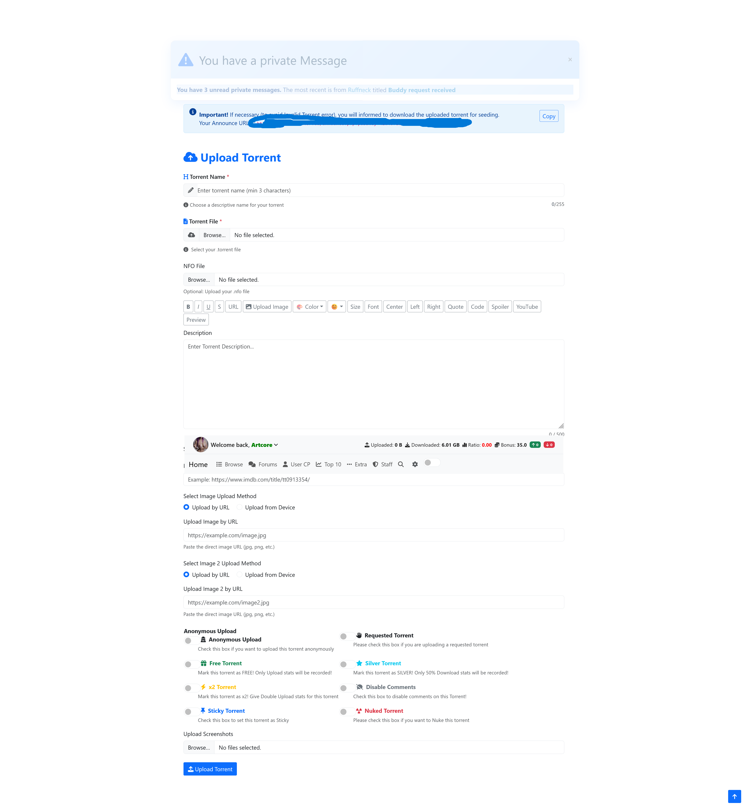
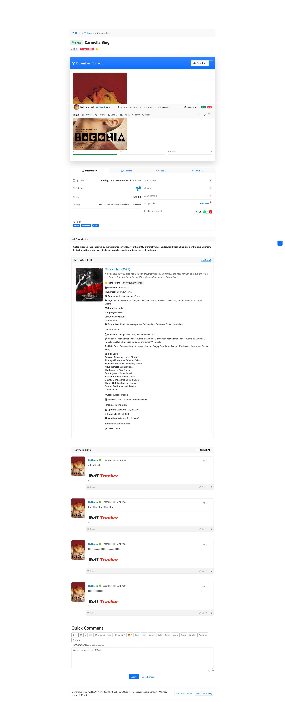
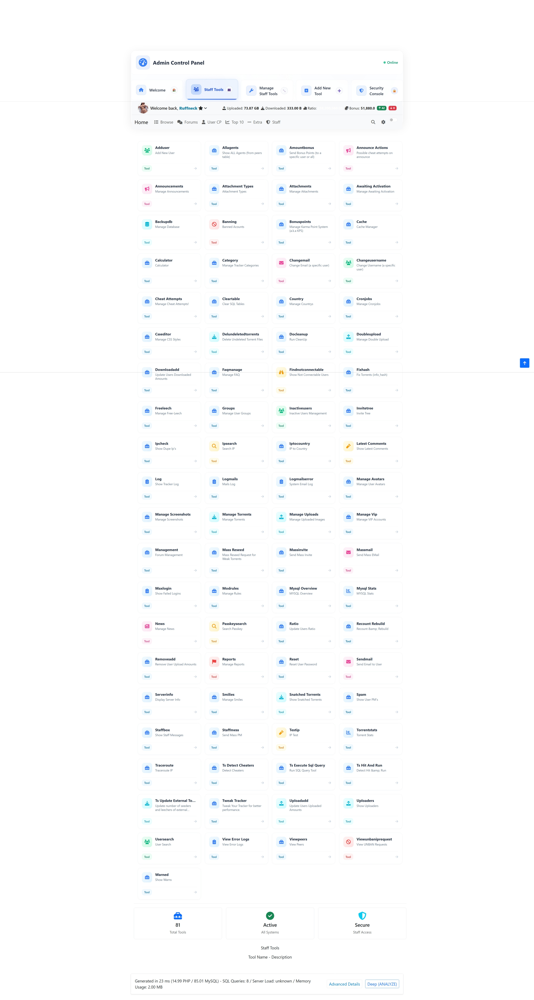

# 🎬 PHP Torrent Tracker

[](https://www.php.net/)
[](https://www.mysql.com/)
[](https://getcomposer.org/)
[](LICENSE)

> ⚡ A lightweight **PHP-based torrent tracker** with announce system,  
> built-in torrent parser, and a simple but functional admin panel.  

Perfect for **private communities**, testing torrent workflows, or learning how trackers work under the hood.  

---

## 📸 Screenshots 

### 🔹 Main Page



### 🔹 Browse Torrent 


### 🔹 Upload page



### 🔹Details Page



### 🔹 Forum


### 🔹 Admin Panel


---

## ✨ Features

**Core**
- 🔗 Fully working announce endpoint with real-time anti-cheat detection (cron-based + live checks)
- 📂 Torrent file parsing via [arokettu/torrent-file](https://github.com/arokettu/torrent-file)
- 🧲 Magnet link generation for external/cross-seeded torrents
- 🎯 Hit-and-Run ratio enforcement with VIP/mod/owner/freeleech exemptions
- ⭐ 10-star thread rating system
- 📎 Forum attachment & comment system

**Security**
- 🔐 Mandatory TOTP-based 2FA for the admin panel (no bypass) with backup codes
- 📧 Email alerts on 2FA enable/disable and new-device login
- 🖥️ Known-devices tracking with session management ("log out everywhere")
- 🕵️ Fake-staff detection — flags accounts in moderator groups not present in the trusted staff list
- 🛡️ CSRF hardening across AJAX endpoints
- 🚫 No-cache headers on sensitive admin pages to prevent stale-page bypass

**Search**
- 🔎 Full-text forum search with live autocomplete suggestions
- 📅 Absolute date-range filtering (from/to) with calendar picker
- 📊 Sort by date, replies, views, rating, subject, author, or forum
- 🃏 Modern card-based results UI

**Admin Panel**
- 📈 Dashboard with stats widgets
- 👤 Per-user admin tools: activity log, security tab, hit & run history, forum activity, audit log, usage stats (Chart.js)
- 🔔 Category-based forum subscription notifications
- 🧰 Unified staff upload/download tool management

**Code Quality**
- 🆕 Fully typed PHP 8.5 codebase (strict types, match expressions, enums where applicable)
- 🧹 Vanilla JS throughout — no jQuery/Select2 dependency
- 🎨 Typed, contextual error pages (404/403/401/500) instead of generic error dumps
- ⚙️ Clean web-based installer with no table-prefix legacy cruft
---

## ⚡ Installation

### Option A — Web Installer (Recommended)
1. Upload all files to your web server
2. Open `http://yoursite.com/install.php` in your browser
3. Follow the step-by-step setup wizard:
   - ✅ Requirements check
   - 🗄️ Database configuration
   - 🌐 Site settings
   - 👤 Admin account creation
   - 🚀 One-click install
4. Delete `install.php` after installation

---

## 📌 Requirements
- PHP 8.5+
- MySQL 9.7 LTS
- Composer
- mod_rewrite (Apache) or equivalent

## 📁 Directory Permissions
```bash
chmod 755 torrents/
chmod 755 uploads/
chmod 755 uploads/avatars/
chmod 755 cache/
chmod 666 include/config.php
chmod 666 include/settings.php
chmod 666 include/config_announce.php
```
